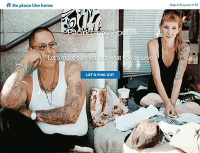
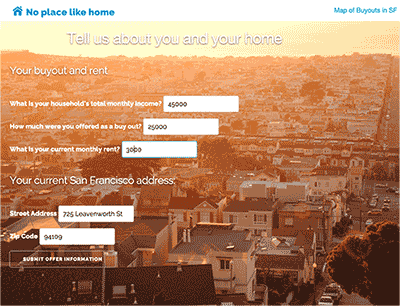
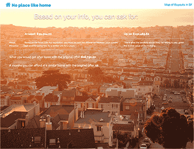
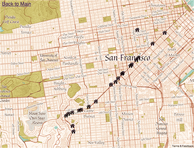

# No Place Like Home

No Place Like Home is a web app for renters faced with buyout offers from their landlords.

Buyout offers - often inequitable - outmatch evictions 7 to 1. Designed to fix the information imbalance between landlords and tenants, No Place Like Home is a step towards fixing some of the major housing issues San Francisco faces.

## How it works

Using the latest data on property values and rent prices across the city of San Francisco, No Place Like Home gives tenants realistic estimates on how much they should get for their apartment.

Tenants are asked to fill out a few questions about their housing situation, such as income, location and amount of the buyout offer (currently only a limited subset of addresses are supported through the Zillow API):

This information is used through the Zillow API to calculate a lower range and an upper range that the tenant should accept.

The *lower range* represents how much money it would take the tenant to make up the difference of two year's rent if they took an equivalent local apartment ([SFist coverage on Ellis Act changes](http://sfist.com/2015/02/04/amended_ellis_act_relocation_law_ca.php)).

The *higher range* represents approximately how much the landlord stands to profit from getting the tenant out of the apartment if the unit was being sold ([Pricenomics](http://priceonomics.com/how-much-should-a-landlord-pay-a-tenant-to-move/)).

This results page also contains information on how much money they will get from the original buyout offer after taxes and how long that amount will cover the difference in rent in an equivalent local apartment at current market rental rates.

Also included in No Place Like Home is a map that reports where buyouts are happening for how much. Public officials and local organizations can use this map to see and respond to buyout trends:

## Technologies
* Zillow API - housing and market rate data
* Mapbox API - interactive map
* Heroku - hosting
* Postgres - database for offer information
* Angular - frontend framework
* Sinatra - backend framework
* Skeleton - CSS library

## History
No Place Like Home was developed during the Accelerate 2015 hackathon in San Francisco, winning 3rd place overall.
